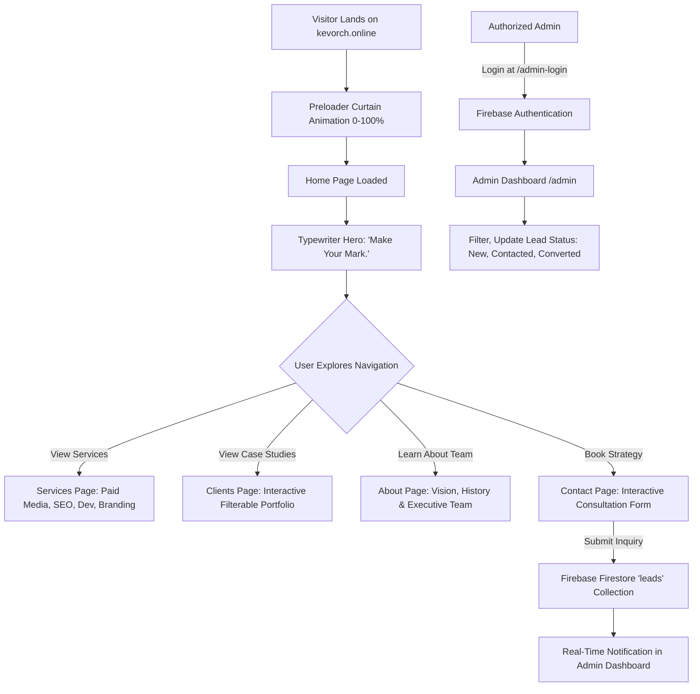

# 🚀 Kevorch SBD Marketing & Development | Official Web Application

[](https://kevorch.online)
[](https://react.dev/)
[](https://www.typescriptlang.org/)
[](https://vitejs.dev/)
[](https://tailwindcss.com/)
[](https://firebase.google.com/)

Welcome to the **Kevorch SBD Marketing & Development** official digital platform repository. This enterprise-grade single-page web application (SPA) represents high-performance web engineering, interactive visual aesthetics, dark/light theme persistence, dynamic lead generation workflows, and multi-engine search optimizations including **SEO**, **GEO** (Generative Engine Optimization), and **AEO** (Answer Engine Optimization).

---

## 📑 Table of Contents

1. [🌟 Executive Overview](#-executive-overview)
2. [🔄 End-to-End System & User Workflow](#-end-to-end-system--user-workflow)
3. [🔍 Search Engine Optimization (SEO) Architecture](#-search-engine-optimization-seo-architecture)
4. [🤖 Generative Engine Optimization (GEO) Strategy](#-generative-engine-optimization-geo-strategy)
5. [🗣️ Answer Engine Optimization (AEO) & Voice Search](#%EF%B8%8F-answer-engine-optimization-aeo--voice-search)
6. [🛠️ Tech Stack & Technical Specifications](#%EF%B8%8F-tech-stack--technical-specifications)
7. [📁 Directory Architecture & Codebase Map](#-directory-architecture--codebase-map)
8. [📄 Pages & Dynamic Route Matrix](#-pages--dynamic-route-matrix)
9. [🔐 Firebase Admin Panel & Lead Pipeline](#-firebase-admin-panel--lead-pipeline)
10. [🚀 Installation, Build & Deployment Guide](#-installation-build--deployment-guide)

---

## 🌟 Executive Overview

**Kevorch SBD Marketing & Development** helps businesses grow through digital marketing, branding, development, and high-converting digital experiences.

The web application is built to deliver:
- **Instant Brand Impression**: High-impact hero section with live typewriter text rendering `"Make Your Mark."`.
- **Dynamic Aesthetics**: High-end dark/light theme switching, crimson ambient glow effects, floating magnetic buttons, and marquee ticker animations.
- **Native Scroll Performance**: Zero-lag native browser scrolling paired with smooth route restoration via `SmoothScroll`.
- **Full Lead Pipeline**: Interactive multi-step consultation booking connected live to Firebase Firestore with role-authenticated admin dashboard management.
- **Tri-Optimization Engine**: Purpose-built for traditional Search Engines (Google, Bing), AI Search Generators (Gemini, ChatGPT, Perplexity), and Direct Answer Engines (Siri, Alexa, Google Assistant).

---

## 🔄 End-to-End System & User Workflow



### Key Workflow Phases:

1. **Preloader & Page Hydration**:
   - Initial loading curtain tracks asset hydration (`0%` to `100%`) before triggering a GSAP timeline curtain reveal.
2. **Hero & Dynamic Branding**:
   - Hero section triggers a smooth typewriter effect displaying `"Make Your Mark."` followed by core value proposition messaging.
3. **Interactive Service Discovery & Filtering**:
   - Visitors can filter portfolio case studies by service category (*Paid Media & SEO*, *Branding & Web Dev*, *UI/UX & Social Marketing*).
4. **Lead Capture & Real-time Persistence**:
   - Contact form validates user inquiry details (Name, Email, Phone, Service Interest, Budget, Message) and commits the lead directly into Firebase Firestore.
5. **Admin Operations**:
   - Protected route `/admin` requires Firebase Authentication. Admins manage lead statuses (`New`, `In Progress`, `Completed`, `Archived`) in real-time.

---

## 🔍 Search Engine Optimization (SEO) Architecture

The application enforces standard SEO best practices on every page using a custom `<SEO>` management component (`src/components/SEO.tsx`).

### 1. Title Tag & Meta Description Standards
- **Title Scoping**: Scoped cleanly per route with brand identity suffix (`Kevorch SBD Marketing & Development`).
- **Homepage Meta Snippet**:
  > `"Make Your Mark. Kevorch SBD Marketing & Development helps businesses grow through digital marketing, branding, and development."`

### 2. Social Graph Integration (Open Graph & Twitter)
Every page dynamically updates head tags to generate rich social previews when shared on LinkedIn, WhatsApp, Facebook, and X (Twitter):
- `og:site_name`, `og:title`, `og:description`, `og:url`, `og:type`, `og:image`
- `twitter:card` (`summary_large_image`), `twitter:title`, `twitter:description`, `twitter:image`

### 3. Canonical Tag Verification
- Automatic canonical URL injection (`<link rel="canonical" href="https://kevorch.online/..." />`) prevents duplicate content indexing.

### 4. Technical Indexing Protocol
- Static deployment includes pre-configured `robots.txt` and comprehensive `sitemap.xml` listing all indexable pages (`/`, `/about`, `/services`, `/clients`, `/contact`).

---

## 🤖 Generative Engine Optimization (GEO) Strategy

**GEO** (Generative Engine Optimization) ensures that Large Language Models (LLMs) and AI Search Engines (such as Google Gemini, ChatGPT Search, Perplexity AI, Claude, and Bing Copilot) accurately extract, understand, and cite Kevorch SBD Marketing & Development as an authoritative entity.

```
       +-------------------------------------------------------------+
       |             Generative AI Search Engine (Gemini)            |
       +-------------------------------------------------------------+
                                     ^
                                     |  Structured Entity Knowledge
                                     |  (JSON-LD & Semantic Tree)
                                     v
+-------------------------------------------------------------------------+
|                  Kevorch SBD Web Platform (GEO Engine)                  |
|                                                                         |
|  1. Factual Organization Schema (@id: #organization)                    |
|  2. Canonical Entity Identification (slogan: "Make Your Mark.")        |
|  3. Core Service Taxonomy (Paid Media, SEO, Branding, Development)     |
|  4. Verified Social Profiles (sameAs Links)                             |
+-------------------------------------------------------------------------+
```

### GEO Implementation Principles in Codebase:

1. **Entity Graph Modeling via JSON-LD (`application/ld+json`)**:
   - Structured JSON-LD graphs define explicit entity relationships using schema.org types:
     - `@type: Organization`: Defines official name, slogan (`"Make Your Mark."`), logo, official URL (`https://kevorch.online`), and official social profiles (`sameAs`: Instagram, WhatsApp).
     - `@type: WebSite`: Links the website publisher back to the parent Organization ID.
     - `@type: AboutPage`: Establishes agency capabilities and executive domain authority.
     - `@type: ItemList` / `@type: Service`: Categorizes service offerings in clean machine-readable node trees.

2. **Unambiguous Brand Statements**:
   - Avoids vague slogans or floating claims.
   - States explicit core capabilities clearly: Digital Marketing, Meta Ads, Google Ads, SEO, Brand Identity, Web Development, and Creative Media Production.

3. **Machine-Readable Semantic Hierarchy**:
   - Uses strict HTML5 semantic tags (`<header>`, `<main>`, `<section>`, `<article>`, `<footer>`, `<h1>`, `<h2>`) enabling AI crawlers to parse content blocks without DOM ambiguity.

---

## 🗣️ Answer Engine Optimization (AEO) & Voice Search

**AEO** (Answer Engine Optimization) prepares content to serve as direct answers for featured snippets, voice search queries (Google Assistant, Siri, Alexa), and conversational Q&A interfaces.

```
User Query: "What services does Kevorch SBD Marketing & Development offer?"
                     │
                     ▼
       ┌───────────────────────────┐
       │   AEO Engine / Voice Assistant   │
       └─────────────┬─────────────┘
                     │ Matches FAQ Schema & Scoped Paragraph
                     ▼
       ┌───────────────────────────┐
       │  Direct Answer Snippet    │
       │ "Kevorch SBD offers Meta  │
       │  Ads, Google Ads, SEO,   │
       │  Branding & Development."│
       └───────────────────────────┘
```

### AEO Technical Capabilities:

1. **JSON-LD `FAQPage` Schema**:
   - Integrated into the Contact Page (`src/pages/Contact.tsx`), embedding structured `@type: Question` and `@type: Answer` schema arrays:
     ```json
     {
       "@type": "FAQPage",
       "@id": "https://kevorch.online/contact#faq",
       "mainEntity": [
         {
           "@type": "Question",
           "name": "What services does Kevorch SBD Marketing & Development offer?",
           "acceptedAnswer": {
             "@type": "Answer",
             "text": "Kevorch SBD specializes in digital marketing, Meta Ads, Google Ads, Search Engine Optimization (SEO), brand identity design, web development, and visual media production."
           }
         }
       ]
     }
     ```

2. **Direct Answer Paragraph Structuring**:
   - First paragraphs across key sections are written in direct, concise target definitions (<50 words) to qualify for Google Position Zero (Featured Snippet).

3. **Natural Conversational Language Scoping**:
   - Headings mirror real human inquiry patterns (e.g., *"How quickly can we expect campaign results?"*, *"What is your project development process?"*).

---

## 🛠️ Tech Stack & Technical Specifications

| Category | Technology | Version | Purpose & Implementation Details |
| :--- | :--- | :--- | :--- |
| **Frontend Framework** | [React](https://react.dev/) | `19.0.0` | UI component layer with high concurrency & strict mode |
| **Language** | [TypeScript](https://www.typescriptlang.org/) | `5.7.2` | End-to-end type safety across components, props, and data models |
| **Build Engine** | [Vite](https://vitejs.dev/) | `8.1.5` | Next-gen bundling, instant HMR, and production asset optimization |
| **CSS Framework** | [Tailwind CSS](https://tailwindcss.com/) | `v4.0` | Utility-first styling with modern native CSS variables |
| **UI Motion** | [Framer Motion](https://www.framer.com/motion/) | `12.4` | Declarative UI animations, modal presence, and page transitions |
| **Timeline Motion** | [GSAP](https://greensock.com/gsap/) | `3.14` | ScrollTrigger timeline orchestrations & preloader curtain effects |
| **Backend & DB** | [Firebase](https://firebase.google.com/) | `11.3` | Authentication for Admin portal & Firestore database for Lead management |
| **Icons** | [Lucide React](https://lucide.dev/) | `0.475` | Lightweight modern vector icon set |
| **Routing** | [React Router](https://reactrouter.com/) | `7.1` | Client-side routing with dynamic layout wrapping |
| **Hosting** | [Firebase Hosting](https://firebase.google.com/docs/hosting) | CDN | Global Edge CDN hosting with zero-downtime deployment |

---

## 📁 Directory Architecture & Codebase Map

```text
web1/
├── .agents/                 # AI Agent rules & customized workspace skills
├── public/                  # Static public distribution assets
│   ├── favicon.ico          # Browser tab favicon
│   ├── favicon.png          # PNG brand icon
│   ├── robots.txt           # Search crawler indexing rules
│   └── sitemap.xml          # XML sitemap protocol manifest
├── src/
│   ├── animations/          # GSAP animation timeline builders
│   │   ├── contact.ts       # Contact form animation triggers
│   │   ├── counters.ts      # Number increment timelines
│   │   ├── hero.ts          # Hero section text split & reveal sequence
│   │   ├── loader.ts        # Preloader curtain reveal sequence
│   │   ├── navbar.ts        # Dynamic header scroll transformations
│   │   ├── portfolio.ts     # Work showcase reveal animations
│   │   └── services.ts      # Service cards entrance triggers
│   ├── components/          # Reusable UI Components
│   │   ├── CustomCursor.tsx # Interactive magnetic cursor indicator
│   │   ├── Footer.tsx       # Universal footer container & social links
│   │   ├── MagneticButton.tsx # Cursor magnet wrapper component
│   │   ├── Marquee.tsx      # Infinite horizontal sliding logo ticker
│   │   ├── Navbar.tsx       # Universal top header navigation bar
│   │   ├── Preloader.tsx    # Initial pre-mount animated loading curtain
│   │   ├── ScrollProgress.tsx # Top reading progress bar indicator
│   │   ├── SEO.tsx          # Dynamic Head & Meta Tag Management component
│   │   ├── SmoothScroll.tsx # Route change scroll restoration helper
│   │   └── ThemeToggle.tsx  # Dark / Light mode toggle button
│   ├── context/             # React Context State Providers
│   │   └── ThemeContext.tsx # Global theme mode manager (Dark/Light)
│   ├── data/                # Static Data Repositories & Mock Data
│   │   ├── executiveData.ts # Executive leadership profile data
│   │   └── mockData.ts      # Services list, case studies, & testimonials
│   ├── hooks/               # Custom React Physics & Motion Hooks
│   │   ├── useCounter.ts    # Number counter animation hook
│   │   ├── useMagnetic.ts   # Cursor proximity magnet hook
│   │   ├── useParallax.ts   # Scroll parallax offset calculation hook
│   │   ├── useReveal.ts     # ScrollTrigger element visibility observer
│   │   └── useSplitText.ts  # Text character splitting hook
│   ├── lib/                 # Third-party SDK initializations
│   │   └── firebase.ts      # Firebase App, Auth, & Firestore instances
│   ├── pages/               # Primary View Pages
│   │   ├── About.tsx        # Agency profile, vision, & leadership team
│   │   ├── Admin.tsx        # Protected lead management dashboard
│   │   ├── AdminLogin.tsx   # Firebase authenticated admin login
│   │   ├── Clients.tsx      # Work portfolio & filterable case studies
│   │   ├── Contact.tsx      # Strategy consultation booking form & FAQ
│   │   ├── Home.tsx         # Main Landing Page
│   │   └── Services.tsx     # Full solution capabilities showcase
│   ├── services/            # Backend API Service Wrappers
│   │   └── leadService.ts   # Firestore lead CRUD functions
│   ├── types/               # TypeScript Definitions
│   │   └── index.ts         # Service, Client, Lead, & Theme interfaces
│   ├── App.tsx              # App Root Layout, Router Setup & Theme Context
│   ├── index.css            # Global CSS, Tailwind v4 imports & custom utilities
│   └── main.tsx             # Application DOM entry point
├── firebase.json            # Firebase Hosting rewrite rules & cache headers
├── index.html               # Main HTML entry file & primary SEO meta tags
├── package.json             # NPM dependencies & build scripts
├── tsconfig.json            # Master TypeScript configuration
└── vite.config.ts           # Vite bundler & path alias configuration
```

---

## 📄 Pages & Dynamic Route Matrix

| Route Path | Page Component | Primary Purpose | SEO & GEO Highlights |
| :--- | :--- | :--- | :--- |
| `/` | `Home.tsx` | Main agency landing page | Typewriter `"Make Your Mark."`, `Organization` & `WebSite` JSON-LD schemas |
| `/about` | `About.tsx` | Agency mission, team & story | Leadership profiles, `AboutPage` JSON-LD schema |
| `/services` | `Services.tsx` | Detailed service capabilities | Categorized Service breakdown, `ItemList` JSON-LD schema |
| `/clients` | `Clients.tsx` | Portfolio & case studies | Filterable category tags, Client ROI metrics, `Portfolio` JSON-LD |
| `/contact` | `Contact.tsx` | Consultation form & FAQs | Real-time lead submission, `ContactPage` & `FAQPage` AEO schema |
| `/admin-login` | `AdminLogin.tsx` | Portal login for site admins | Firebase Auth sign-in interface, index follow disabled |
| `/admin` | `Admin.tsx` | Lead management dashboard | Real-time Firestore lead tracking & status filter dashboard |

---

## 🔐 Firebase Admin Panel & Lead Pipeline

The platform includes an embedded Firebase-powered CRM system for real-time lead management.

1. **Lead Submission (`Contact.tsx`)**:
   - Visitors fill out the consultation booking form.
   - Form submits payload via `leadService.ts` (`addDoc` to Firestore `leads` collection) with `timestamp`, `status: "new"`, name, email, phone, service interest, budget, and message.
2. **Admin Authentication (`AdminLogin.tsx`)**:
   - Authenticates site administrators using `signInWithEmailAndPassword` via Firebase Auth.
3. **Admin Dashboard (`Admin.tsx`)**:
   - Protected route using state observer (`onAuthStateChanged`).
   - Fetches and displays incoming inquiries with live search, status filtering (`All`, `New`, `In Progress`, `Contacted`, `Archived`), and single-click status update actions.

---

## 🚀 Installation, Build & Deployment Guide

### Prerequisites
- **Node.js**: `v18.0.0` or higher
- **NPM**: `v9.0.0` or higher
- **Firebase CLI**: `npm install -g firebase-tools`

### 1. Clone & Install Dependencies
```bash
git clone https://github.com/kevorchsbd-org/kevorch-website-.git
cd kevorch-website-
npm install
```

### 2. Environment Configuration
Create a `.env.local` file in the project root with your Firebase credentials:
```env
VITE_FIREBASE_API_KEY=your_api_key
VITE_FIREBASE_AUTH_DOMAIN=your_project.firebaseapp.com
VITE_FIREBASE_PROJECT_ID=your_project_id
VITE_FIREBASE_STORAGE_BUCKET=your_project.appspot.com
VITE_FIREBASE_MESSAGING_SENDER_ID=your_sender_id
VITE_FIREBASE_APP_ID=your_app_id
```

### 3. Local Development Server
Start Vite local server with instant HMR:
```bash
npm run dev
```
Navigate to `http://localhost:5173` in your browser.

### 4. Build for Production
Run TypeScript compilation and Vite asset bundler:
```bash
npm run build
```
Production assets will be output to the `dist/` directory.

### 5. Deploy to Firebase Hosting
```bash
# Login to Firebase CLI
firebase login

# Deploy production bundle
firebase deploy --only hosting
```

---

*© 2026 Kevorch SBD Marketing & Development. All rights reserved.*
